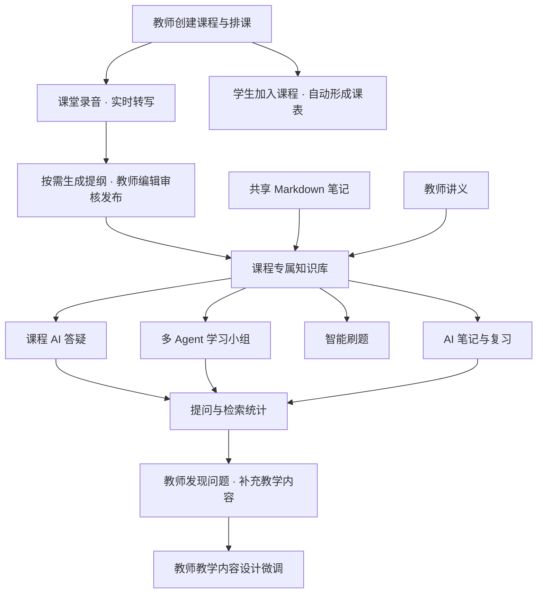

<div align="center">
  
  <h1>知伴 · 定制化助学助教</h1>
  <p><strong>让每一节课，都有自己的 AI。</strong></p>
  <p>课堂记录 · 课程专属知识库 · 多 Agent 学习小组 · 智能笔记 · 针对性刷题</p>
  <p>HarmonyOS 原生应用 ｜ 手机与平板适配 ｜ 教师与学生双端协同</p>
</div>

知伴是一款面向真实课堂的定制化助学助教应用。它将课堂语音转写、教师审核发布的课程提纲、教学资料和共享学习内容组织为**按课程隔离、关联具体课次的知识库**，为课程答疑、智能笔记、AI 学习小组和针对性练习提供共同依据，让课堂知识在课后继续发挥价值。

## 测试体验账号

以下内容由项目维护者填写。注：**所有功能均已实现**，测试账号仅代表测试期间预设的已有账号，有部分课程信息已经录入并使用，能够较好地全面体现产品功能。也可以现场注册新账号，邮件发送功能已完整实现，但注册的空账号需要自行添加课程（学生端）以及录音建立课堂知识库等（教师端），**功能与已有账号完全一样**，但体验功能时需自行建立内容，相对耗时。

>| 体验身份 | 登录方式（个人 / 学校） | 学校名称（如适用） | 账号（邮箱 / 学号 / 工号） | 密码 |
>| :---: | :---: | :---: | :---: | :---: |
>| 学生 | 个人 | / | student@student.zhiban | 66666666 |
>| 教师 | 个人 | / | teacher@teacher.zhiban | 88888888 |

**建议体验课程：** 高等数学（该课程测试时录入过一段课程语音，后台服务器有一节课的记录，其余课程测试时未使用，为空课程，功能一致但没有已经录入的课程语音和课程知识库）

## 项目创新点

### 1. 以真实课堂为来源的课程专属知识库

知伴围绕“这门课、这节课、老师实际讲过的内容”组织 AI 服务。教师录音产生课堂记录，随后按需生成提纲，经教师编辑、审核与发布后成为课程知识来源；上传讲义及共享 Markdown 笔记补充知识内容。课程、课次、文档来源和发布状态共同构成内容组织与访问的依据。

技术上采用 **ASR 语音转写 + LLM 内容结构化 + 教师审核发布 + 课程隔离的检索增强生成（RAG）**。检索结合 Jieba 分词、BM25 关键词召回和可配置的向量检索，通过排名融合组织上下文。创新重点在于贯穿课堂采集、内容治理和学习应用的完整流程，以及多个功能对同一课程知识基础的复用。

### 2. 真人与多 Agent 协作的 AI 学习小组

同学可以共同参与讨论，AI 学伴根据不同角色推进理解。调度模块结合最新发言选择合适的角色回复，也支持通过 `@组员A` 等方式指定学伴。四位学伴共享课程知识背景，但承担不同的讨论任务：

| AI 学伴 | 讨论分工 |
| --- | --- |
| 组员 A · 学习引导者 | 明确学习目标，通过循序渐进的提问推动讨论，提醒偏题并梳理阶段重点。 |
| 组员 B · 思辨者 | 检查结论的前提，展开原理推导，追问论证中的漏洞，帮助形成严谨理解。 |
| 组员 C · 提问者 | 提出基础疑问、复述自己的理解，暴露容易被忽视的认知误区。 |
| 组员 D · 查漏补缺者 | 补充细节、特殊案例与待确认事项，提醒讨论中遗漏的重点。 |

**学习记录与最终总结由独立的辅助 LLM 调用整理**，与四位学伴的讨论分工分离。总结涵盖知识点、不同理解、易错点、未解决问题与复习建议，可导出为 Markdown。这里的“独立”指职责和调用流程分离，不要求使用不同的模型供应商。

### 3. 从学习过程回到教学改进

同一课程知识库连接问答、笔记、资料共享和练习。学生可以将 AI 回答整理为笔记，再围绕课程知识点练习；教师通过提问量、知识库未命中情况和高频问题关键词，观察学生关注的内容与可能存在的知识覆盖缺口，补充讲义或调整教学重点。

### 4. 贴合课堂场景的 HarmonyOS 多端体验

手机侧强调随身查看课表、快速进入课程；平板侧提供适合录音、资料对照、手写和小组讨论的工作台布局。教师排课后，学生加入课程即可获得对应课表。应用采用统一的光感视觉、卡片层次、触屏反馈与页面切换动效，并接入手写、NFC、应用接续与系统分享能力。

## 从一堂课到持续学习



课堂转写与提纲生成是两个操作：先记录课堂，再按需整理提纲。课程知识检索按可见内容和发布状态筛选，私有笔记不会因保存而自动成为班级共享资料。

## 当前功能

### 学生端

| 功能 | 已实现能力 |
| --- | --- |
| 个人主页与课表 | 手机端按周展示已加入课程的上课安排，支持周次、单双周、节次、教室和冲突课程查看；点击课程进入学习空间。 |
| 课程与课次 | 查看课程概览和课次时间线，在具体课堂中浏览转写、已发布提纲、教师资料及关联笔记。 |
| 课程 AI 答疑 | 从导航栏旁的 AI 入口提问，接收流式回答，查看历史对话；回答支持 Markdown 与数学公式展示。 |
| AI / Markdown 笔记 | 根据课堂内容与选定材料整理笔记，将 AI 回答加入笔记，支持编辑、重命名、删除和发布共享。 |
| 手写笔记 | 支持矢量笔迹、本机草稿、离开提醒、草稿恢复、跨屏缩放与共享；触控笔压力可映射为线宽。 |
| 共享学习资源 | 浏览课程内共享笔记与教师资料，区分个人内容和课程共享内容，进入具体资料阅读。 |
| 智能刷题 | 按当前课程及所选课次加载出题上下文，选择知识点、难度和出题要求；支持智能组卷、章节巩固、错题强化、判题解析与答题统计。 |
| AI 学习小组 | 创建或加入课程小组，选择单 AI 伴学或多 AI 讨论；支持成员管理、学习总结与导出，退出或已结束的小组不再显示在当前列表。 |
| 账号与设置 | 个人 / 学校账号登录注册、邮箱验证码、找回与修改密码，以及账号安全和协同相关设置。 |

### 教师端

| 功能 | 已实现能力 |
| --- | --- |
| 课程创建与排课 | 创建课程、设置邀请码、维护上课时段和教室；学生加入后按教师安排查看课表。 |
| 课堂记录 | 通过常驻浮动录音入口开启课堂记录，支持实时转写、暂停 / 结束、音频缓存和失败重试。 |
| AI 课程提纲 | 基于课堂内容生成、编辑、审核与发布提纲；教师资料工作台集中查看课程提纲。 |
| 教学资料 | 上传 PDF、PPTX 和文本资料，支持文档解析与扫描内容识别；在“已上传资料”中浏览已有文件。 |
| AI 数据 | 查看学生累计提问、知识库未命中数量及比例、高频问题关键词等信息，辅助发现教学关注点。 |
| 教师 AI | 客户端提供通用模型提问入口，用于备课、教学及其他问题，与学生的课程答疑入口区分。 |
| 学习小组管理 | 参与课程小组，查看学习总结，管理成员及讨论状态。 |

## 账号、角色与 AI 模式

| 维度 | 模式与说明 |
| --- | --- |
| 账号类型 | **个人账号**使用邮箱；**学校账号**使用学校名称及学号 / 工号。注册界面可选择学生或教师身份，身份核验状态与角色权限分别管理。 |
| 使用角色 | **学生**侧重学习、笔记与练习；**教师**侧重课程组织、课堂记录、内容发布与教学反馈。课程管理操作还需校验课程归属。 |
| 学生课程答疑 | 使用课程知识检索组织回答上下文，并展示可用的来源信息。资料不足时应说明依据，不能把通用知识表述为教师原话。 |
| 教师通用问答 | 客户端以通用问答模式发起请求，不附加学生端的课程记忆约束；实际响应规则以部署服务端对该模式的支持为准。 |
| 单 AI 伴学 | 保留真人交流，使用 `@AI` 发起问题，普通聊天不触发 AI 插话。 |
| 多 AI 讨论 | 由角色调度和四位 AI 学伴参与讨论，独立辅助调用整理学习记录与总结。 |

## 技术实现

| 层次 | 技术与职责 |
| --- | --- |
| 原生客户端 | ArkTS、ArkUI、Stage 模型；手机 / 平板 / 2in1 布局、手写、动效与设备协同。 |
| 业务服务 | Python、FastAPI、SQLModel；账号会话、课程成员、课次、笔记、小组和练习接口。 |
| 课堂语音 | 华为云 SIS 实时语音识别；客户端与业务服务通过 WebSocket 传输音频和识别结果。 |
| 内容整理与问答 | OpenAI 兼容的 LLM 接口；提纲生成、流式问答、多 Agent 调度与学习总结。 |
| 知识检索 | Jieba + BM25、Chroma 向量存储与可配置 Embedding；结合课程、可见性和内容版本筛选检索范围。 |
| 文档处理 | PDF / PPTX / 文本解析、OCR、异步导入与任务状态管理。 |
| 内容渲染 | Markdown 与 KaTeX 数学公式渲染、HTML 净化，以及跨页面复用的展示组件。 |

知识库采用课程级隔离，内容关联具体课次；不需要为每位学生建立独立数据库。业务层通过登录会话、资源所有权和课程成员关系控制访问。共享笔记与私有笔记具有不同可见性，向量检索结果还需匹配有效文档版本。

向量检索依赖 Embedding 服务配置，未启用时可使用关键词检索。模型效果取决于课堂资料质量、模型配置与输入内容；提纲提供教师审核流程，AI 生成内容仍需结合教学事实判断。

## 项目结构

以下列出主要开发目录：

```text
HarmonyOS-CampusAssistant/
├─ README.md                         项目介绍与体验入口
├─ assets/branding/                  品牌 Logo
├─ client/                           HarmonyOS 客户端
│  ├─ AppScope/                      应用级配置与资源
│  ├─ entry/src/main/ets/
│  │  ├─ common/                    主题、动效与复用组件
│  │  ├─ pages/                     学生端、教师端业务页面
│  │  ├─ model/                     数据模型
│  │  └─ service/                   API、状态、录音与设备协同
│  ├─ entry/src/main/resources/      图片、字符串与公式渲染资源
│  └─ tests/                        客户端回归测试
├─ server/                           FastAPI 服务端
│  ├─ app/routers/                   业务接口
│  ├─ app/services/                  ASR、检索、LLM 与多 Agent 服务
│  ├─ tests/                         服务端测试
│  ├─ .env.example                   配置示例，不含正式密钥
│  └─ DEPLOYMENT.md                  部署与维护说明
└─ demo-site/                        产品介绍页面与展示素材
```

## 开发与运行

### 客户端

1. 使用 DevEco Studio 打开 `client/`，按工程配置安装匹配的 HarmonyOS SDK，并完成 Hvigor Sync。
2. 在 IDE 中配置当前开发机的签名，运行 `entry` 模块。
3. 确保设备能够访问已部署的业务服务，登录后创建或加入课程。

当前工程的最低兼容配置为 **HarmonyOS 5.0.0 / API 12**，目标 SDK 配置为 **6.1.1 / API 24**，支持 Phone、Tablet 和 2in1。具体以 [构建配置](client/build-profile.json5) 和 [模块配置](client/entry/src/main/module.json5) 为准。

客户端接口地址集中在 [Api.ets](client/entry/src/main/ets/service/Api.ets) 的 `BASE_URL`；登录页不提供地址编辑。需要连接其他开发服务时修改该配置并重新构建。录音需要麦克风权限与可用的网络连接。

### 服务端配置

服务端已独立部署，日常体验直接使用现有服务。本节仅说明新开发环境的配置入口，不要求重建或重启现有部署。

- Python 3.11+，依赖见 [requirements.txt](server/requirements.txt)。
- 以 [环境配置示例](server/.env.example) 为参考，配置 LLM、语音识别、Embedding、SMTP、数据库及资料存储。
- 启动方式、实时识别参数和进程部署要求见 [后端部署说明](server/DEPLOYMENT.md)。
- 健康检查路径为 `/health`，接口文档为 `/docs`，业务 API 前缀为 `/api/v1`。
- 服务端密钥保留在服务端环境配置中；本机签名材料及账号凭据不应作为项目资料公开。

### 设备协同与验证边界

应用已接入 NFC 标签读取、系统应用接续和 Share Kit 隔空传送接口。握拳抓取 / 张手释放需要支持相应系统能力的 **API 20+ 真机**；普通模拟器或不支持该能力的设备不能代表实际效果。M-Pencil 压感、跨设备传送和连续课堂录音效果需在目标设备与实际课堂环境中验证。

### 测试

客户端测试位于 `client/tests/`，覆盖 AI 入口、Markdown / 公式展示、笔记共享、小组列表、课次出题上下文、统计状态、录音、课表与动效等逻辑。安装或指定 TypeScript 模块后，可使用 Node.js 内置测试运行器执行：

```powershell
# 在仓库根目录运行；部分测试需要 TypeScript。
# 若 TypeScript 不在 Node 模块搜索路径，设置为本机已有模块的路径：
# $env:RECORDING_TEST_TYPESCRIPT = '你的 TypeScript 模块绝对路径'
$tests = Get-ChildItem client/tests -Filter '*.test.cjs' | ForEach-Object { $_.FullName }
node --test $tests
```

服务端测试位于 `server/tests/`；请在独立开发或测试环境中安装依赖后执行，不使用生产数据进行测试：

```powershell
cd server
python -m unittest discover -s tests -v
```

---

<div align="center">
  <strong>知伴，让课堂不止停留在铃响之前。</strong>
</div>
