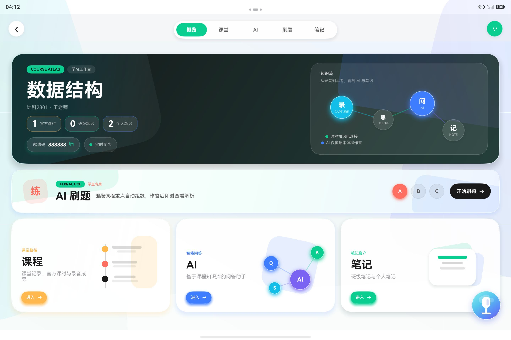

# 智慧伴学（智伴）

面向 HarmonyOS 的课堂 AI 协同学习应用，覆盖账号认证、课程工作台、课堂录音转写、知识库、个人与班级笔记、MAS 讨论和 AI 选择题练习。本次实现及验收差异见 [IMPLEMENTATION_REPORT.md](IMPLEMENTATION_REPORT.md)。



## 功能概览

- **课程工作台**：按课程显示官方课时、个人笔记和班级笔记统计，每 3 秒同步一次服务端快照。
- **课堂记录**：采集 16 kHz 单声道 PCM 音频，分片上传 ASR，并基于转写生成 Markdown 提纲。
- **课程知识库**：SQL 控制文档可见性，支持 PDF/PPTX/文本导入、扫描页识别、BM25 与向量混合检索、重建及连接测试。
- **AI 与 MAS**：支持单助手问答，以及分析、质疑、类比、总结等不同性格智能体参与的课堂讨论。
- **笔记工作台**：支持 Markdown/AI 笔记、矢量手写笔记、个人管理、班级共享和再次编辑。
- **刷题**：根据课程知识库、知识点、难度和用户要求生成选择题，提供判题与解析。
- **账号与会议**：邮箱验证码注册、学校账号、个人空间、鉴权会话、课程聊天室、智能体批量回复和会议纪要。
- **HarmonyOS 协同**：NFC 标签接续、系统隔空传送、跨端状态接续。隔空传送通过 Share Kit 接入握拳抓取/张手释放，要求支持该能力的 API 20+ 真机。

## 两种运行模式

| 目录 | 用途 | 后端 |
| --- | --- | --- |
| `client/` + `server/` | 日常开发和实际前后端联调 | FastAPI + SQLite + Chroma + 可配置 LLM/ASR |
| `competition-unified/` | 比赛单 HAP 演示 | HAP 内嵌 ArkTS 本地后端，无需 Python 服务 |

统一比赛版保持与网络版相同的页面 API，但 AI、ASR 和知识检索采用离线演示逻辑，不包含 Python、Chroma 或第三方模型运行时。实际部署应使用 `client/` 与 `server/` 的前后端分离结构。

## 项目结构

```text
HarmonyOS-CampusAssistant/
├─ client/                 HarmonyOS ArkTS 网络版客户端
├─ server/                 FastAPI 业务、AI、ASR 与 RAG 服务
├─ competition-unified/    单 HAP 比赛版源码
├─ image/README/           README 图片资源
├─ 演示图/                  功能演示截图
├─ 产品需求文档.md
└─ 实现流程.md
```

## 启动网络后端

要求 Python 3.11+。PowerShell 示例：

```powershell
cd E:\code\HarmonyOS-CampusAssistant\server
python -m venv .venv
.\.venv\Scripts\python.exe -m pip install -r requirements.txt
if (!(Test-Path .env)) { Copy-Item .env.example .env }
.\.venv\Scripts\python.exe prepare_models.py
.\.venv\Scripts\python.exe run.py --host 0.0.0.0 --port 8000 --workers 1
```

启动后可访问：

- 健康检查：`http://127.0.0.1:8000/health`
- Swagger API：`http://127.0.0.1:8000/docs`
- API 前缀：`http://127.0.0.1:8000/api/v1`

`.env.example` 包含 LLM、ASR、OCR、Embedding、数据库和存储目录配置。ASR 默认使用本地 CPU Whisper，模型下载后无需语音服务密钥；OCR 默认使用本地 RapidOCR。未安装语音模型会明确报错，只有显式设置 `ASR_PROVIDER=mock` 才使用模拟转写。未配置 LLM 时仍使用演示回答。

默认单进程；同机多进程需使用 `run.py`，启用向量检索时必须连接共享 Chroma HTTP 服务，详见 [部署说明](server/DEPLOYMENT.md)。原有用户和课程保留，但预置身份不再能直接登录。首次启动后，可在服务端本机给原有教师绑定学校账号；密码通过隐藏输入读取，不写入命令行：

```powershell
.\.venv\Scripts\python.exe manage_accounts.py --list
.\.venv\Scripts\python.exe manage_accounts.py --user-id 1 --school "学校名称" --number "教师工号"
```

使用实际列表中的用户 ID。该命令保留原角色和课程，不会把注册学生提升为教师。客户端首次打开显示登录/注册，学校账号使用学校名称、学号或工号和密码登录；个人账号需要服务端配置 SMTP。`/auth/users` 必须带 Bearer token，匿名请求返回 401 属于预期。

## 运行网络版客户端

1. 使用 DevEco Studio 6.0+ 打开 `client/`。
2. 等待 Hvigor Sync 完成。
3. 在 `Project Structure > Signing Configs` 中为本机生成调试或发布签名。
4. 启动 API 12+ 的 Tablet、2in1 或 Phone 设备，运行 `entry` 模块。
5. 模拟器默认通过 `http://10.0.2.2:8000/api/v1` 访问宿主机；真机请在应用设置页填写电脑局域网地址。

签名证书、密码、HAP、`oh_modules` 和构建缓存均不进入 Git 仓库。

## 构建单 HAP 比赛版

1. 使用 DevEco Studio 打开 `competition-unified/client/`。
2. 完成 Hvigor Sync，并为当前开发机配置签名。
3. 选择 `entry` 模块和 `release` 构建模式。
4. 执行 `Build > Build Hap(s)/APP(s) > Build Hap(s)`。

默认输出目录：

```text
competition-unified/client/entry/build/default/outputs/default/
```

应用启动时由 `EntryAbility.onCreate()` 初始化内嵌后端，数据保存在 HarmonyOS 应用沙箱的 `zhiban_local_backend.json` 中。无需启动桌面端服务。

## 数据隔离

网络版使用 Bearer 会话校验资源所有权和课程成员资格；SQL 控制知识文档可见性，Chroma 按课程与模型配置使用独立 collection。比赛版使用一个应用沙箱 JSON 文件，并在每条记录上保存课程 ID。

如需重置网络版 Demo 数据，停止服务后删除 `server/smartstudy.db` 和 `server/data/`，再次启动会恢复种子数据。

## 测试

安装服务端依赖后运行：

```powershell
cd server
.\.venv\Scripts\python.exe -m unittest discover -s tests -v
```

隔离的完整接口回归测试（不修改现有课程数据）：

```powershell
.\.venv\Scripts\python.exe smoke_test.py
```

当前 36 项测试覆盖账号认证、密码安全、会议成员权限及纪要导出、课程权限、录音幂等、本地 ASR 校验、个人与官方提纲、异步导入及恢复、真实 OCR、Chroma 检索与历史版本清理、进程写锁、并发会议、聊天 SSE、MAS 和刷题 JSON 校验。`smoke_test.py` 可追加 `--base-url http://127.0.0.1:8000` 检查运行服务；设置 `SMOKE_TOKEN` 后还会验证该账号的只读接口。

## 验收限制

网络版已改为正式登录和接口鉴权。登录页提供找回密码，设置中提供账号安全（修改密码、学校账号绑定找回邮箱）。改密会撤销所有设备登录。聊天室提供成员添加、移除、退出与主持权转交。

手写笔记支持本机草稿、离开提示与恢复，并按画布尺寸缩放跨设备笔迹。知识库上传返回后台任务，页面显示进度及失败重试；会议纪要可导出 Markdown。手机竖屏采用紧凑导航、分栏切换与换行操作栏，平板保留现有工作台。

离线比赛版仍保留演示逻辑。手机和平板模拟器已验证主要页面及手写保存/恢复；本地中文 ASR 和 OCR 已实际调用验证。M-Pencil 压感、系统隔空传送、课堂噪声识别准确率和录音缓存恢复仍需真机验收。当前华为 SIS 配置实测返回 401，已使用本地 ASR；发布前还需完成签名、真实 SMTP/LLM/Embedding 验证。
